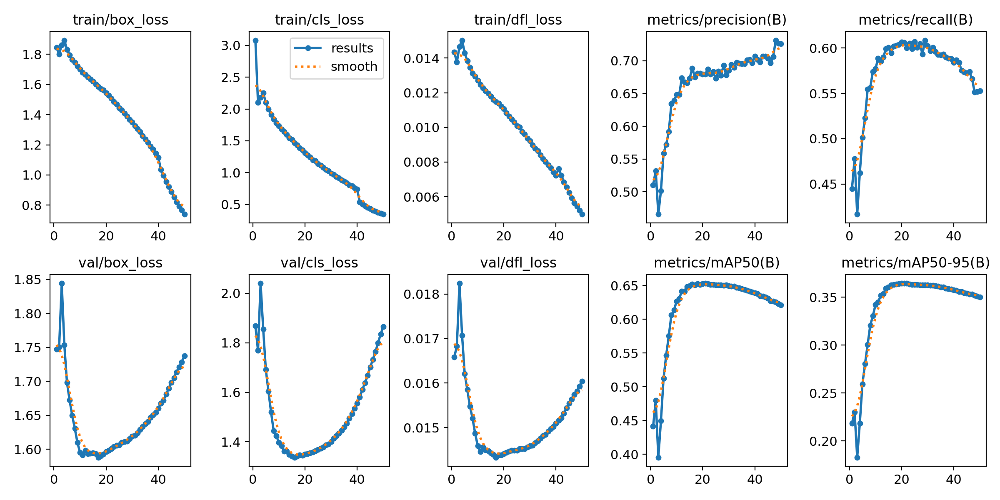
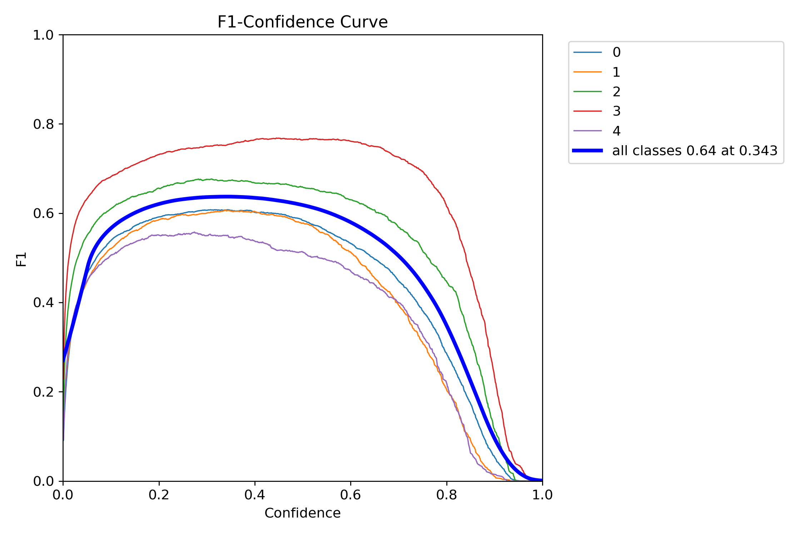
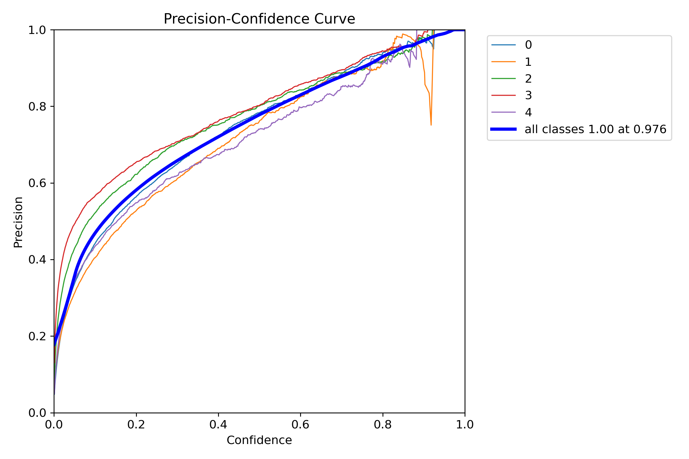
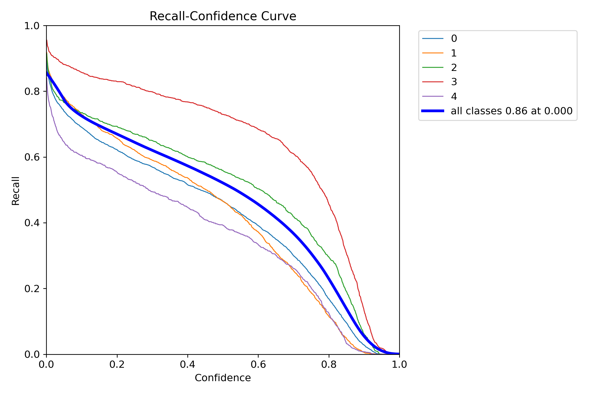
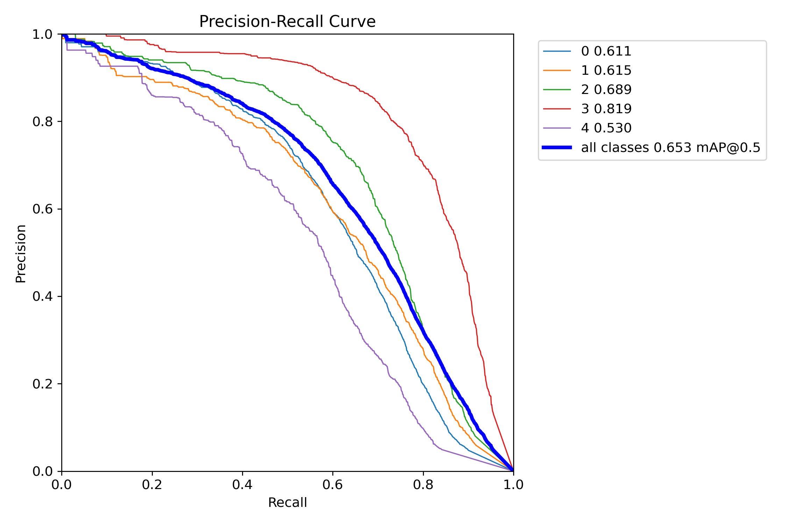
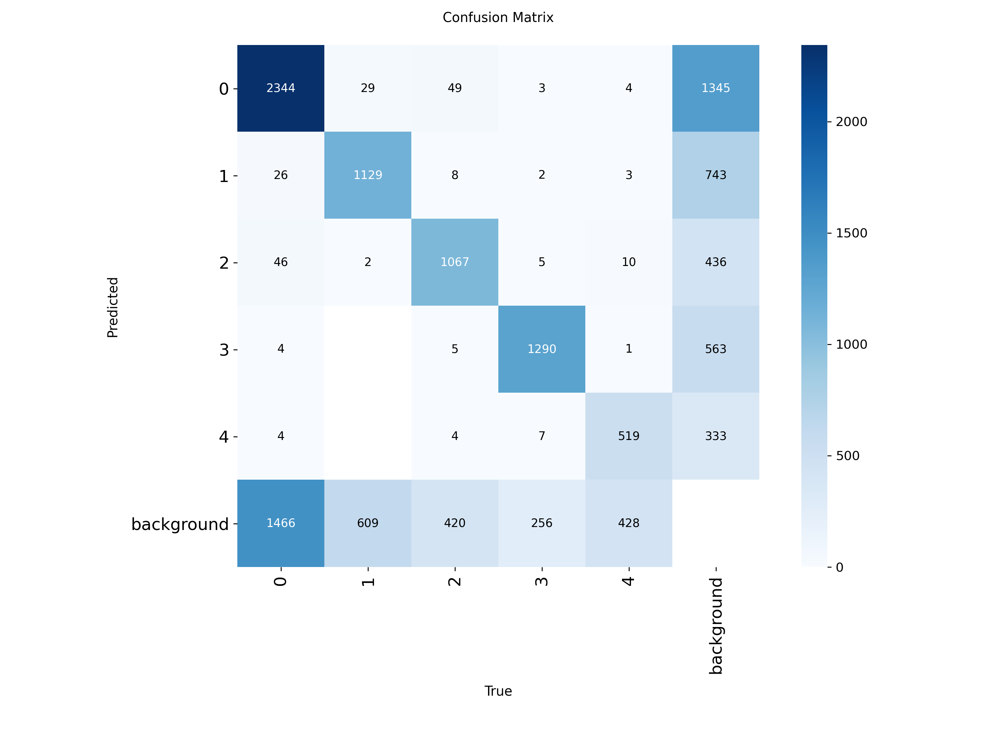
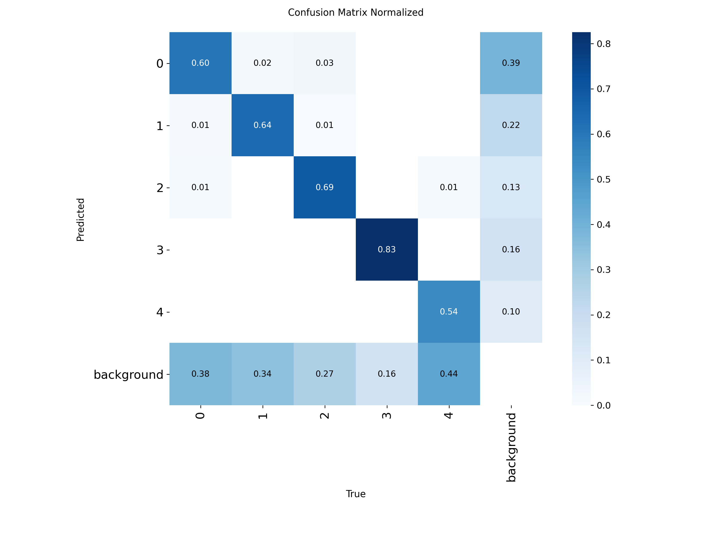

#  YOLO-Based Pavement Crack and Infrastructure Defect Detection

This repository contains the training results, evaluation metrics, and model performance visualizations for a **YOLO object detection model** fine‑tuned to detect and classify **five types of pavement surface distresses**.


---

##  Project Overview

- **Model Architecture**: YOLO26 (inferred from loss components: `box_loss`, `cls_loss`, `dfl_loss`)
- **Task**: Multi‑class object detection
- **Number of Classes**: **5**
- **Training Epochs**: 50
- **Input Resolution**: 640×640 (default YOLO)

The model was trained to assist in automated road inspection by identifying:
- Longitudinal cracks
- Transverse cracks
- Alligator (fatigue) cracks
- General infrastructure defects
- Potholes

---

##  Dataset Preprocessing & Augmentation

The training dataset was prepared using the following preprocessing pipeline and augmentation strategies to improve model robustness and generalization.

###  Preprocessing
| Step | Description |
|------|-------------|
| **Auto‑Orient** | Automatically corrects image orientation based on EXIF metadata. |
| **Resize** | Images are stretched to **640×640** pixels (YOLO default input size). |
| **Grayscale** | All images are converted to single‑channel grayscale. |

###  Augmentations
*Applied during training with **3 augmented outputs per original example**.*

| Augmentation | Parameters |
|--------------|------------|
| **Flip** | Horizontal and Vertical |
| **Brightness** | Random adjustment between **‑15% and +15%** |
| **Blur** | Gaussian blur up to **2.5 pixels** |
| **Noise** | Salt‑and‑pepper noise affecting up to **0.1%** of pixels |

These augmentations help the model become invariant to orientation, lighting variations, and minor image degradation common in real world pavement inspection scenarios.

---

## 🏷 Class Labels

| Class ID | Class Name              | Description                                                                 |
|:--------:|:------------------------|:----------------------------------------------------------------------------|
|    0     | **Longitudinal Crack**  | Cracks running parallel to the pavement centreline.                          |
|    1     | **Transverse Crack**    | Cracks running perpendicular to the pavement centreline.                     |
|    2     | **Alligator Crack**     | Interconnected cracks forming a pattern similar to alligator skin.           |
|    3     | **Infrastructure Defect** | Man‑made features like manhole covers, patches, or utility cuts.            |
|    4     | **Pothole**             | Bowl‑shaped depressions in the pavement surface.                             |

---

##  Training Results Summary

The model was trained for **50 epochs**. Below are the final validation metrics (epoch 50) extracted from [`results.csv`](detect/train/results.csv):

| Metric                   | Value    |
|--------------------------|----------|
| **Precision (B)**        | 0.7256   |
| **Recall (B)**           | 0.5527   |
| **mAP@0.5**              | 0.6213   |
| **mAP@0.5:0.95**         | 0.3502   |
| **Validation Box Loss**  | 1.7377   |
| **Validation Class Loss**| 1.8650   |

###  Training Progress Charts

The following image (`results.png`) visualises the evolution of losses and metrics over the 50 epochs:



*Top row: training losses; bottom row: validation metrics.*

---

##  Detailed Performance Analysis

###  F1 – Confidence Curve



The **F1 score** reaches its maximum of **0.64** at a confidence threshold of **0.343**. This indicates the optimal balance between precision and recall when filtering predictions.

###  Precision – Confidence Curve



Precision remains high across confidence levels, with **all classes achieving 1.00 at confidence 0.976**. This confirms the model makes very few false positive predictions when using a high confidence threshold.

###  Recall – Confidence Curve



Recall drops as confidence increases—typical behaviour. The **all‑classes recall at confidence 0.000 is 0.86**, meaning 86% of all ground‑truth objects are detected at the lowest threshold.

###  Precision – Recall Curve



The **PR curves** show the trade‑off for each class. The area under these curves corresponds to the **Average Precision (AP)**. Class **3 (Infrastructure Defect)** exhibits the highest AP, while class **4 (Pothole)** is the most challenging.

---

##  Confusion Matrix

### Raw Counts


### Normalised by True Labels


#### Key Observations:
- **Background FP**: 609 false positives are predicted as background (i.e., missed detections).
- **Class Confusion**:
  - **Class 0 (Longitudinal)** is occasionally mistaken for class **1 (Transverse)** (2% error) and class **2 (Alligator)** (3%).
  - **Class 1 (Transverse)** is well distinguished, with only 1% confusion with class 0.
  - **Class 2 (Alligator)** has a **13% confusion rate with class 3 (Infrastructure Defect)**, suggesting visual similarity with some man‑made features.
  - **Class 3 (Infrastructure Defect)** achieves **83% correct classification**, the highest among all classes.
  - **Class 4 (Pothole)** has the lowest diagonal value (54%), indicating difficulty in detection/classification.

---

##  Repository Files

| File Name                         | Description                                                                 |
|-----------------------------------|-----------------------------------------------------------------------------|
| `results.csv`                     | Full epoch‑by‑epoch training/validation metrics (losses, precision, recall, mAP). |
| `results.png`                     | Graphical summary of training progress.                                      |
| `BoxF1_curve.png`                 | F1 score vs. confidence threshold for each class and all classes combined.   |
| `BoxP_curve.png`                  | Precision vs. confidence threshold.                                          |
| `BoxR_curve.png`                  | Recall vs. confidence threshold.                                             |
| `BoxPR_curve.png`                 | Precision‑Recall curves for each class.                                      |
| `confusion_matrix.png`            | Confusion matrix with absolute counts.                                       |
| `confusion_matrix_normalized.png` | Confusion matrix normalised by true class (row‑wise).                        |
| `labels.jpg`                      | Class label reference image.                                                 |

---

##  How to Use the Trained Model

1. **Clone the repository**
   ```bash
   git clone https://github.com/your-username/pavement-defect-detection.git
   cd pavement-defect-detection
